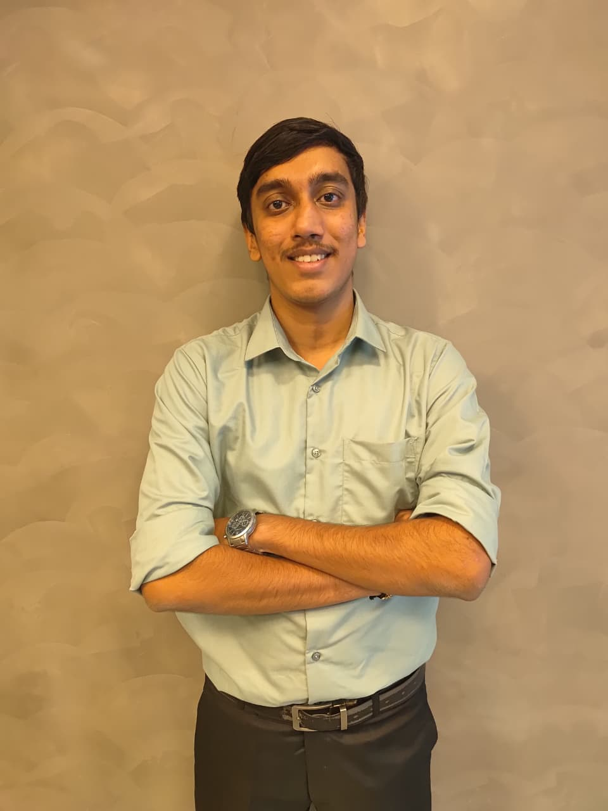

<!DOCTYPE html>
<html lang="en">
<head>
    <meta charset="UTF-8">
    <meta name="viewport" content="width=device-width, initial-scale=1.0">
    <title>Adish Poojary - Frontend Developer</title>
    <link href="https://cdnjs.cloudflare.com/ajax/libs/font-awesome/6.0.0/css/all.min.css" rel="stylesheet">
    
</head>
<body>
    <!-- Animated Background Particles -->
    

    <!-- Navigation -->
    <nav>
        

            <a href="#" class="logo">AP</a>
            <ul class="nav-links">
                <li><a href="#home">Home</a></li>
                <li><a href="#about">About</a></li>
                <li><a href="#projects">Projects</a></li>
                <li><a href="#experience">Experience</a></li>
                <li><a href="#contact">Contact</a></li>
            </ul>
        

    </nav>

    <!-- Hero Section -->
    <section id="home" class="hero">
        

            <!-- Profile Photo Placeholder - Replace src with your actual photo URL -->
            
            
            

                <h1>Adish Poojary</h1>
                
Frontend Developer & AI Enthusiast

                

                    Passionate Computer Science student crafting innovative web applications with modern technologies. 
                    Specializing in React, Next.js, and AI-powered solutions with a keen eye for user experience.
                

                

                    <a href="#projects" class="cta-button">View My Work</a>
                    <a href="#contact" class="cta-button secondary">Get In Touch</a>
                

            

        

    </section>

    <!-- About Section -->
    <section id="about">
        <h2 class="section-title">About Me</h2>
        

            

                <h3>Hello! I'm Adish</h3>
                

                    I'm a Computer Science Engineering student at SMVITM, Udupi, with a passion for creating 
                    exceptional digital experiences. My journey in tech spans across frontend development, 
                    AI/ML projects, and full-stack applications.
                

                

                    I enjoy turning complex problems into simple, beautiful, and intuitive solutions. When I'm 
                    not coding, you'll find me exploring new technologies, participating in hackathons, or 
                    contributing to open-source projects.
                

                

                    Currently pursuing my Bachelor's degree and actively seeking opportunities to apply my 
                    skills in real-world projects and internships.
                

            

            

                

                    <i class="fab fa-react"></i>
                    
React

                

                

                    <i class="fab fa-js"></i>
                    
JavaScript

                

                

                    <i class="fab fa-python"></i>
                    
Python

                

                

                    <i class="fab fa-node-js"></i>
                    
Node.js

                

                

                    <i class="fab fa-html5"></i>
                    
HTML5

                

                

                    <i class="fab fa-css3-alt"></i>
                    
CSS3

                

                

                    <i class="fab fa-git-alt"></i>
                    
Git

                

                

                    <i class="fab fa-docker"></i>
                    
Docker

                

            

        

    </section>

    <!-- Projects Section -->
    <section id="projects">
        <h2 class="section-title">Featured Projects</h2>
        

            

                <h3>NOVA - AI Voice Assistant</h3>
                

                    Developed a Python-based AI voice assistant with GUI, capable of executing system commands, 
                    fetching information, and automating tasks via voice recognition.
                

                

                    Python
                    PyQt5
                    Deepgram
                    OpenCV
                

                

                    <a href="#"><i class="fab fa-github"></i> GitHub</a>
                    <a href="#"><i class="fas fa-external-link-alt"></i> Live Demo</a>
                

            

            

                <h3>Healthcare Patient Management System</h3>
                

                    Built a responsive healthcare platform for patient registration, doctor appointments, and 
                    admin scheduling with real-time SMS notifications.
                

                

                    Next.js
                    TypeScript
                    Appwrite
                    Twilio
                

                

                    <a href="#"><i class="fab fa-github"></i> GitHub</a>
                    <a href="#"><i class="fas fa-external-link-alt"></i> Live Demo</a>
                

            

            

                <h3>AI Powered Code Reviewer</h3>
                

                    Developed an AI-based code review platform with real-time feedback and improvement suggestions 
                    using Google Gemini API for intelligent code analysis.
                

                

                    MERN Stack
                    Google Gemini
                    API Integration
                

                

                    <a href="#"><i class="fab fa-github"></i> GitHub</a>
                    <a href="#"><i class="fas fa-external-link-alt"></i> Live Demo</a>
                

            

            

                <h3>Blood Group Detection using Fingerprints</h3>
                

                    Innovative non-invasive blood group detection system leveraging fingerprint image analysis 
                    using Convolutional Neural Networks with high accuracy classification.
                

                

                    PyTorch
                    TensorFlow
                    Flask
                    CNN
                

                

                    <a href="#"><i class="fab fa-github"></i> GitHub</a>
                    <a href="#"><i class="fas fa-external-link-alt"></i> Research Paper</a>
                

            

        

    </section>

     <title>Technical Skills Section</title>
    <link href="https://cdnjs.cloudflare.com/ajax/libs/font-awesome/6.0.0/css/all.min.css" rel="stylesheet">
    
</head>
<body>
    <section class="skills-section">
        <h2 class="section-title">Technical Skills</h2>
        
Technologies I work with to bring ideas to life

        
        

            <!-- Programming Languages -->
            

                

                    

                        <i class="fas fa-code"></i>
                    

                    <h3 class="category-title">Languages</h3>
                

                

                    

                        <i class="fab fa-python skill-icon python-icon"></i>
                        
Python

                    

                    

                        <i class="fab fa-java skill-icon java-icon"></i>
                        
Java

                    

                    

                        <i class="fas fa-code skill-icon"></i>
                        
C

                    

                    

                        <i class="fas fa-database skill-icon"></i>
                        
SQL

                    

                    

                        <i class="fab fa-js skill-icon js-icon"></i>
                        
JavaScript

                    

                    

                        <i class="fab fa-js skill-icon"></i>
                        
TypeScript

                    

                    

                        <i class="fab fa-html5 skill-icon"></i>
                        
HTML

                    

                    

                        <i class="fab fa-css3-alt skill-icon"></i>
                        
CSS

                    

                

            

            <!-- Frameworks & Platforms -->
            

                

                    

                        <i class="fas fa-layer-group"></i>
                    

                    <h3 class="category-title">Frameworks</h3>
                

                

                    

                        <i class="fas fa-flask skill-icon"></i>
                        
Flask

                    

                    

                        <i class="fab fa-react skill-icon react-icon"></i>
                        
React

                    

                    

                        <i class="fab fa-node-js skill-icon node-icon"></i>
                        
Node.js

                    

                    

                        <i class="fas fa-rocket skill-icon next-icon"></i>
                        
Next.js

                    

                    

                        <i class="fas fa-desktop skill-icon"></i>
                        
PyQt5

                    

                

            

            <!-- Developer Tools -->
            

                

                    

                        <i class="fas fa-tools"></i>
                    

                    <h3 class="category-title">Developer Tools</h3>
                

                

                    

                        <i class="fab fa-git-alt skill-icon git-icon"></i>
                        
Git

                    

                    

                        <i class="fab fa-docker skill-icon docker-icon"></i>
                        
Docker

                    

                    

                        <i class="fas fa-bug skill-icon"></i>
                        
Postman

                    

                    

                        <i class="fas fa-database skill-icon"></i>
                        
Appwrite

                    

                    

                        <i class="fas fa-sms skill-icon"></i>
                        
Twilio

                    

                    

                        <i class="fas fa-microphone skill-icon"></i>
                        
Deepgram

                    

                

            

            <!-- Libraries & Frameworks -->
            

                

                    

                        <i class="fas fa-brain"></i>
                    

                    <h3 class="category-title">AI & Data</h3>
                

                

                    

                        <i class="fas fa-robot skill-icon"></i>
                        
TensorFlow

                    

                    

                        <i class="fas fa-fire skill-icon"></i>
                        
PyTorch

                    

                    

                        <i class="fas fa-table skill-icon"></i>
                        
Pandas

                    

                    

                        <i class="fas fa-calculator skill-icon"></i>
                        
NumPy

                    

                    

                        <i class="fas fa-chart-line skill-icon"></i>
                        
Matplotlib

                    

                    

                        <i class="fas fa-eye skill-icon"></i>
                        
OpenCV

                    

                

            

        

    </section>

    

    <!-- Experience Section -->
    <section id="experience">
        <h2 class="section-title">Experience & Activities</h2>
        

            

                <h3>IEEE Member</h3>
                
June 2024 - Present

                

                    Active member of IEEE at SMVITM, participating in tech talks, events, and collaborative 
                    student-led sessions focused on emerging technologies and professional development.
                

            

            

                <h3>Docker Workshops</h3>
                
2023 - 2024

                

                    Attended comprehensive Docker workshops through UniCourt Offline to master containerization 
                    and deployment practices, gaining deep understanding of cloud computing and CI/CD pipelines.
                

            

            

                <h3>Hackathon Participant</h3>
                
2022

                

                    Participated in college-level and national-level hackathons, securing top 10 position in 
                    national competition. Contributed to innovative solutions under time constraints.
                

            

        

    </section>

    <!-- Contact Section -->
    <section id="contact">
        <h2 class="section-title">Get In Touch</h2>
        

            
I'm always interested in new opportunities and exciting projects. Let's connect!

            

                

                    <i class="fas fa-envelope"></i>
                    <h3>Email</h3>
                    <a href="mailto:adishpoojary24@gmail.com">adishpoojary24@gmail.com</a>
                

                

                    <i class="fas fa-phone"></i>
                    <h3>Phone</h3>
                    <a href="tel:+918431571020">+91-8431571020</a>
                

                

                    <i class="fab fa-linkedin"></i>
                    <h3>LinkedIn</h3>
                    <a href="https://linkedin.com/in/adishpoojary" target="_blank">linkedin.com/in/adishpoojary</a>
                

                

                    <i class="fab fa-github"></i>
                    <h3>GitHub</h3>
                    <a href="https://github.com/adishpoojary" target="_blank">github.com/adishpoojary</a>
                

            

        

    </section>

    <!-- Footer -->
    <footer>
        
&copy; 2025 Adish Poojary. Built with passion and code.

    </footer>

    
</body>
</html>